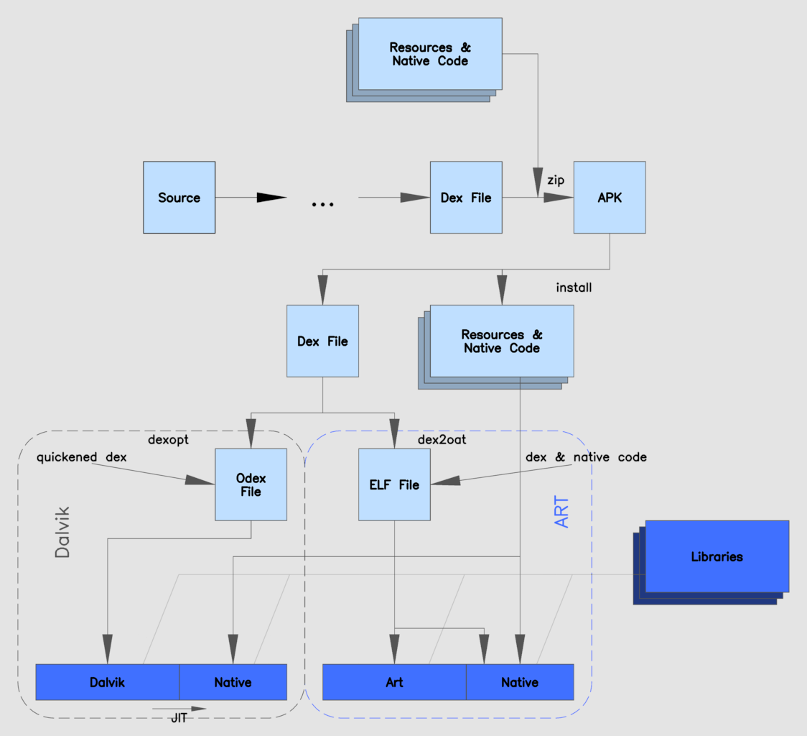

# Raylib on your Android Phone!

> NOTE: Be warned, building C++ apps for android is much more complex than for Linux or Web.
> I recommend you to use [Android Studio](https://docs.conan.io/2/examples/cross_build/android/android_studio.html) 
> if you don't enjoy playing with build tools.
>
> This readme is only here for fun and for developers that refuse to use the tools at their disposal.

If I was building a commercial app or anything that is published on the app store, I would use android studio instead.
That being said, learning how to build an APK was kind-of fun, and I'm only doing these projects for fun.

To cross-compile raylib to Android, we can combine the instructions given by the conan and raylib docs:

- Conan [Cross building to Android with the NDK](https://docs.conan.io/2/examples/cross_build/android/ndk.html#examples-cross-build-android-ndk)
- Raylib [Working for Android (on Linux)](https://github.com/raysan5/raylib/wiki/Working-for-Android-(on-Linux))

In particular, I recommend the Raylib Wiki entry, it explains the minimal set of files and commands
to generate an APK.

## C++ on Android?

The raylib example is C++ code, but android runs java apps, right?
Not quite, it turns out the android world is much more complex, but good news: your android app can run native binaries!

The android team provides an NDK, native development kit, which we can use to compile our C++ code for our desired 
phones. There are a few different things to consider when compiling with the NDK, like the phone's processor 
architecture, and the API level of the phone's Android version. This project uses conan to install the NDK and to 
configure those variables for us. Take a look at the conan [profile](profiles/android.profile) for android.

Android can not run a native executable directly, instead we use the NDK to compile our raylib example as a shared 
library, that our app can load in. Take a look at how we make a shared library [src/CMakeLists.txt](src/CMakeLists.txt)
from our example.

Note that our library has to use the native android APIs to manage the "window", get key inputs, and more, 
luckily raylib already implements this for us. We only have to add the native app glue that the NDK provides,
for which we first need to find the NDK directory: [CMakeLists.txt line 12](CMakeLists.txt).
The app glue is then compiled into our shared library in [src/CMakeLists.txt line 17](src/CMakeLists.txt).

Our native shared library can be loaded using a little bit of java, see our [NativeLoader.java](src/android/NativeLoader.java).
Then we only need two more things: an [AndroidManifest.xml](src/android/AndroidManifest.xml)
that describes our app's metadata, and our app's [icons](src/android/resources) in various resolutions. 
Note that the icons need to follow this `drawable-...dpi` directory structure for android to find the right size icon
for your phone's homescreen.


Then we have all the components to build an android app. Building android apps is done using the android SDK.
Let's see how, this diagram gives an overview of the life of an app:


[](http://creativecommons.org/publicdomain/zero/1.0/)
[By MjolnirPants](https://commons.wikimedia.org/wiki/File:ART_view.png) 

In the diagram, our compiled `libraylib_example.so` is considered `Native Code`.
The icon's and any resources like models and our app icon are `Resources`.
And our small `NativeLoader.java` is part of the `Source` code.

We can see that the `Source` code goes through some `...` steps, more precisely:
1. We give the SDK tool `aapt` our android manifest. This generates an `R.java` file containing some basic 
   code for our app.
2. We use the OpenJDK tool `javac` to compile all our java code into JVM bytecode.
3. We use the SDK tool `d8` to compile our JVM bytecode into Dalvik bytecode, also called "dex".

Then we have to zip all our dexed-code, native-code, and resource files into an APK, and voilà, an app that runs C++ 😎. 
Those steps can all be done by a little script [package_apk.sh](src/android/package_apk.sh).

## Actually Building the APK

With all that explanation out of the way, here is the how to build the example app.

### Prerequisites

Conan can manage the NDK for us, but not the SDK.
The SDK download is hidden at the bottom of the [studio download](https://developer.android.com/studio) page,
the command line tools zip file. The easiest way to use the sdk is to put it in a path like: `cmdline-tools/latest/`.
For example:

```bash
$ ls ~/android/Sdk/cmdline-tools/latest/
bin  lib  NOTICE.txt  source.properties
```

To install the desired SDK, use the sdk manager like:

```bash
~/android/Sdk/cmdline-tools/latest/bin/sdkmanager --install "platforms;android-34" "build-tools;34.0.0"
```

And hit `y` to accept the terms and conditions.

If you use a different install path, or a different version, then please see the start of the
[package_apk](src/android/package_apk.sh) script.

We need to generate a pair of keys for signing our development builds. I would highly recommend not using these keys for anything other than development builds.
And even then it's probably the best if you add this key store to your `.gitignore` file.

```bash
keytool -genkeypair -validity 1000 -dname "CN=raylib,O=Android,C=ES" -keystore raylib.keystore -storepass 'raylib' -keypass 'raylib' -alias projectKey -keyalg RSA
```

To configure the NDK, please take a look at the [android.profile](profiles/android.profile).

### Build lib

We can then install our conan dependencies and build the shared library:

```bash
conan install -u -pr:b=default -pr:h=profiles/android.profile --build=missing  --settings=build_type=Release .

# configure cmake
cmake -G Ninja --preset conan-android-release

# build for release
cmake --build --preset conan-android-release
```

### Build APK

To use the packaging script, please double-check that the environment variables at the top of the
[package_apk](src/android/package_apk.sh) script are correct.

Then you should be able to run:

```bash
$ ./src/android/package_apk.sh
```

The resulting APK is then `./game.apk`.

## Using the APK

You could send the resulting APK to your phone using any transfer method and install it from the phone.
Alternatively you can install it using the SDK tool `adb`.

First to install the platform tools and to start the daemon:

```bash
~/android/Sdk/cmdline-tools/latest/bin/sdkmanager --install "platform-tools"
sudo ~/android/Sdk/platform-tools/adb start-server
```

Then connect your phone to the PC see [this](https://developer.android.com/tools/adb) for more information, check the connection with:

```bash
~/android/Sdk/platform-tools/adb devices -l
```

And finally to install the APK run:

```bash
~/android/Sdk/platform-tools/adb install ./game.apk
```

## Debug APK

If your APK can not be installed, or if your app crashes on startup, you could find more information in the logs using ADB.

```bash
~/Android/Sdk/platform-tools/adb logcat
```
